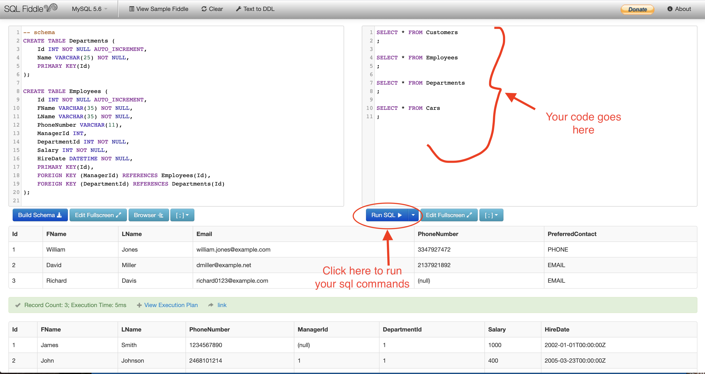

## Overview

Structured Query language (SQL) is pronounced as “S-Q-L” or sometimes as “See-Quel”  which is the standard language for dealing with Relational Databases. SQL is effectively used to insert, search, update, delete and modify database records. It doesn’t mean SQL cannot do things beyond that. In fact, it can do a lot more other things as well.

You will be working on an **Autoshop database**. This database consists of 4 tables: **Customers**, **Employees**, **Departments**, and **Cars**.

You will be using **SQL Fiddle** platform to use sql commands and make changes on these tables. 

[Link for Auto Shop fiddle](http://sqlfiddle.com/#!9/faf2f/1)

# Why Is This Important

SQL is one of the most sought-after skills by hiring employers.

# Prerequisites:

None

# Learning Outcomes

By the end of this tutorial, you should be able to...

1. Get familiar with MySQL commands
1. Interact with databases using MySQL commands
1. Query a database
