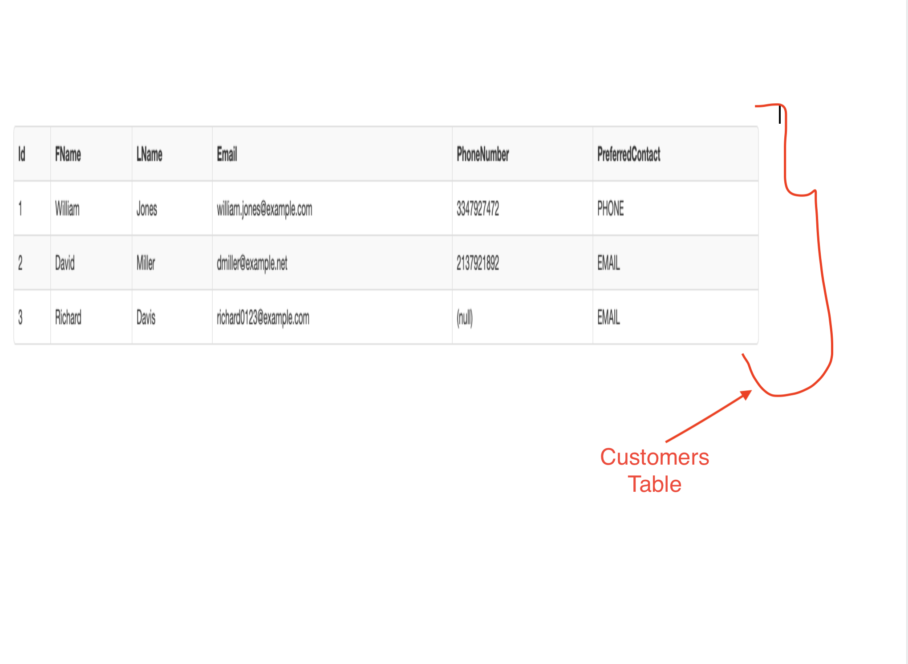
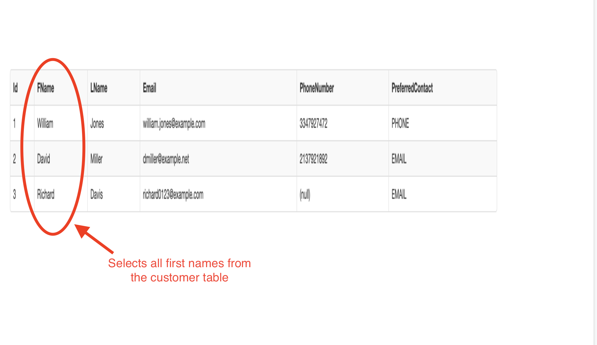
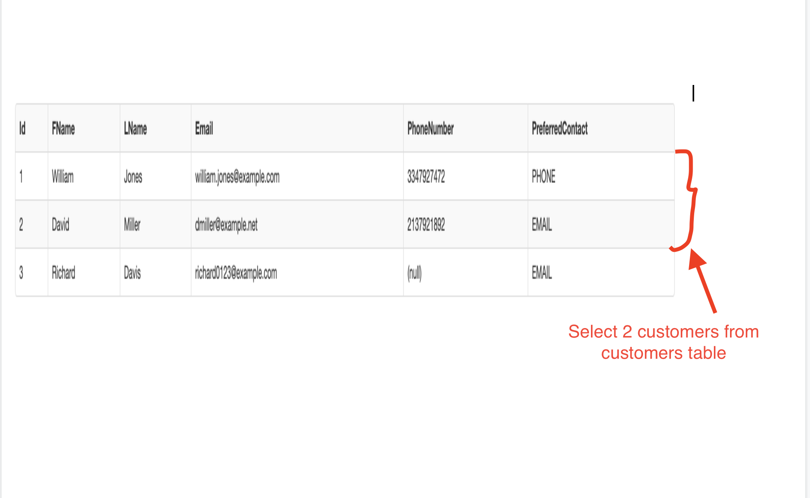
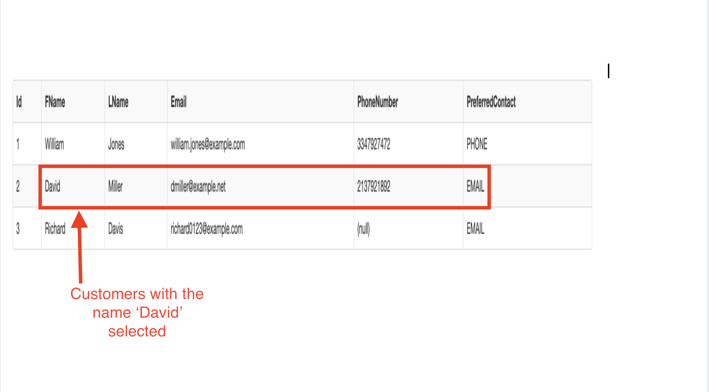

## SQL Keywords

You will be using SQL keywords in order to grab the information you are looking for from the autoshop database.

SQL keywords are used to specify actions in your queries. They are not case sensitive, but it is suggested to use all caps for SQL keywords so that you can easily set them apart from the rest of the query. Some frequently used keywords are:

1. SELECT
1. FROM
1. WHERE

# SELECT

SELECT​ allows us to grab data for specific columns from the database:

`*`​ (asterisk): it is used after *SELECT* to grab all columns from the table.

Example:
> [info]
>
> The code below grabs all the rows from the Customers table.
>

<!--  -->

> [action]
>
> Run this command in the sql-fiddle.
>
```sql
SELECT * FROM Customers
```
> The output of your code should look like the table below.
>



> [info]
>The SELECT block specifies which columns you want to output. Its format is ```SELECT <column>, <column>, ....``` Each column must be separated by a comma.
>

<!--  -->

Example:

> [action]
>
```sql
SELECT FName FROM Customers
```
>



# FROM

FROM​ allows us to specify which table(s) we care about; to select multiple tables, list the table names and use commas to separate them.

To limit the number of rows you get from the result, you can add the keyword **LIMIT**
Run the code below, and see what happens.

``` sql
SELECT * FROM Customers LIMIT 2;
```



> [info]
> You should only see 2 rows from the Customers table since the assigned limit is 2.
>

# WHERE

The **​WHERE**​ clause in a query is used to filter results by specific criteria.

> [action]
>
> Run this command in the sql-fiddle.
>
```sql
SELECT * FROM Customers WHERE FName = 'David'
```
>

This command selects all customers whose first name is David.



Let's try some of these queries below.

# Activity
> [challenge]
Here are some challenges you can try on your own on the SQL fiddle
> - Select all employees
> - Select all departments
> - Select all cars
> - Select salary of all employees
> - Select the model of all cars
> - Select Customers whose preferred contact is email
>


# Resources
https://www.edureka.co/blog/top-10-reasons-to-learn-sql/

https://mystery.knightlab.com/walkthrough.html
