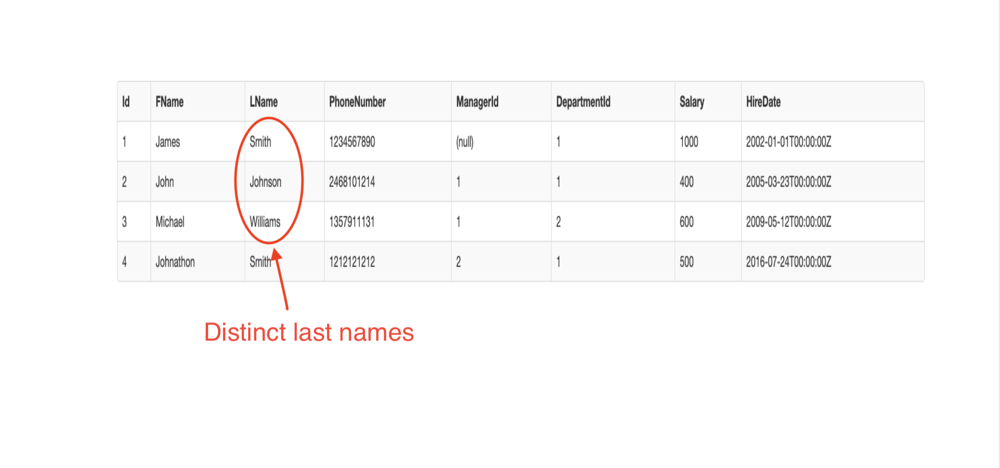

## Distinct Keyword

The SQL DISTINCT keyword is used in conjunction with the SELECT statement to eliminate all the duplicate records and fetching only unique records.

There may be a situation when you have multiple duplicate records in a table. While fetching such records, it makes more sense to fetch only those unique records instead of fetching duplicate records.

> [action]
>
> Run this command in the sql-fiddle. There are two Employees with similar last names. And this command fetches only the unique LName from Employees.
>
```sql
SELECT DISTINCT LName FROM Employees
```
>




# Activity
> [challenge]
Here are some challenges you can try on your own on the SQL fiddle
> - Select distinct DepartmentId from Employees table
> - Select all unique preferredContact from the Customers table
> - Select all unique car models from the Cars table


## Resources
https://www.edureka.co/blog/top-10-reasons-to-learn-sql/

https://mystery.knightlab.com/walkthrough.html

https://www.tutorialspoint.com/sql/sql-distinct-keyword.htm
