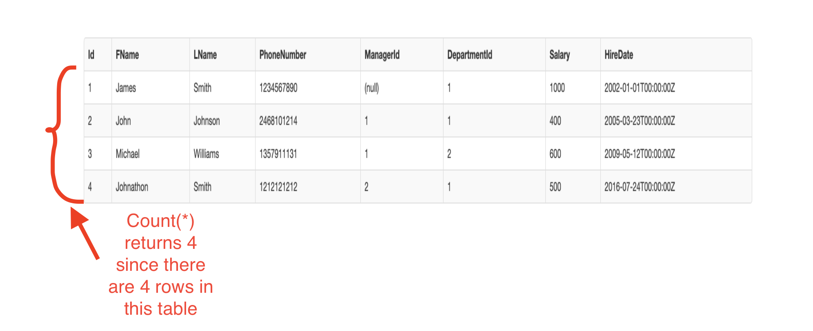
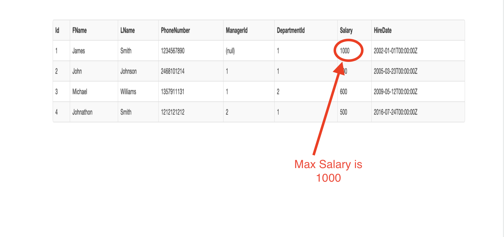

## SQL Aggregate Functions

An aggregate function performs a calculation one or more values and returns a single value. The aggregate function is often used with the GROUP BY clause and HAVING clause of the SELECT statement.

Here are a few useful aggregate functions SQL provides:

# MAX
Returns the maximum value in a set.
The max() function accepts a valid expression or a column name as an argument.

> [info]
> Usage:
> MAX(expression) or MAX(column_name)
>

# MIN
Returns the minimum value in a set.
Just like the max(), the min() function accepts a valid expression or a column name as an argument.

> [info]
> Usage:
> MIN(expression) or MIN(column_name)
>

# SUM
Calculates the sum of the specified column values. It excludes adding any null value inside the column.

> [info]
> Usage:
> SUM(column_name)
> SUM(DISTINCT column_name) - returns only the sum of unique values in the column.

# AVG
Calculates the average of the specified column values.

> [info]
> Usage:
> AVG(column_name)
>

# COUNT​
It returns the number of items for a given set. Counts the number of specified column values.

> [info]
> Usage:
> COUNT(*) - returns the number of rows in a specified table. Including null and duplicate values.
> COUNT(ALL expression) -  evaluates the expression for each row in a set and returns the number of non-null values.
> COUNT(DISTINCT expression) - evaluates the expression for each row in a set, and returns the number of unique, non-null values.
>



# Example
> [action]
>
> Run this command in the sql-fiddle.
> This command selects the employee with the maximum salary.
>
```sql
SELECT max(salary) FROM Employees
```
>



# Activity
> [challenge]
Here are some challenges you can try on your own on the SQL fiddle
> - Select an employee with the most recent hire data
> - Select an employee with the minumum salary
> - Count the number of rows in the cars table
> - Count the number of rows in the cars table where the total cost is greater than $200.
> - Find the average salary of employees
>


# Resources

https://mystery.knightlab.com/walkthrough.html

https://www.sqlservertutorial.net/sql-server-aggregate-functions/

https://www.sqlservertutorial.net/sql-server-aggregate-functions/sql-server-count/
