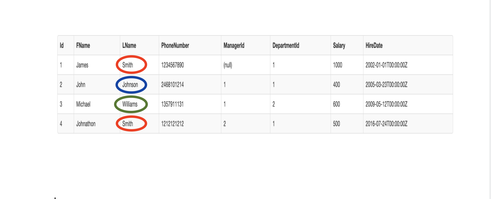

## Grouping data within a table

So let's say we want to know how many employees have similar last names. This is where the **Group By** keyword comes in.

It allows us to split up the dataset and apply aggregate functions within each group, resulting in one row per group.

> [action]
>
> Run this command in the sql-fiddle.
> This command selects last names of employees and counts. Then groups them by their last name. If you run the command, you'll see distnict last names in one column and their count on another column.
>
```sql
SELECT LName, count(*) FROM Employees Group By LName
```
>




# Activity
> [challenge]
Here are some challenges you can try on your own on the SQL fiddle
> - Select the preferred contact of customers and group it by preferred contact
> - Select Models of Cars with their count and group them by the Model.
> - Select Models of Cars with their count and group them by their Status.
>

# Resources
https://selectstarsql.com/longtail.html
